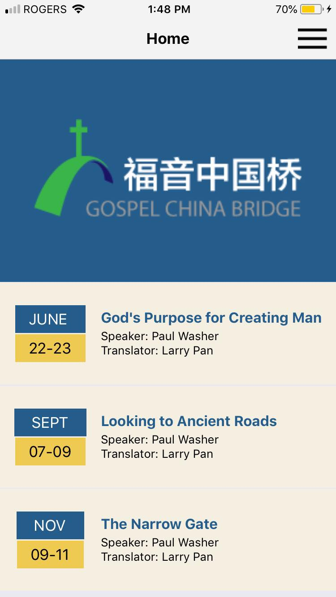
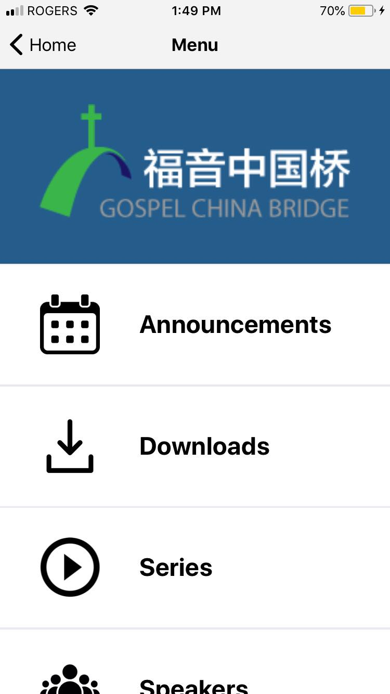
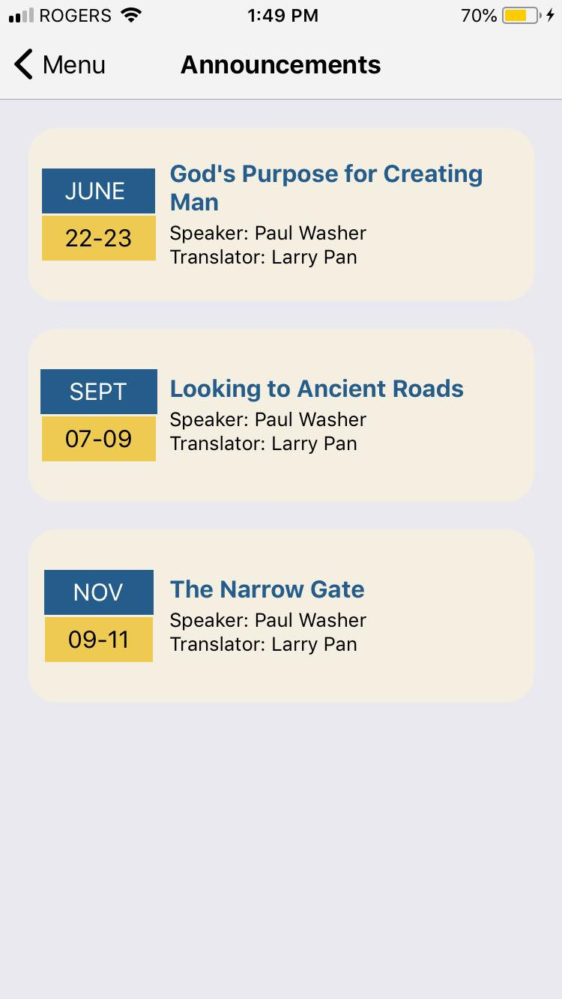
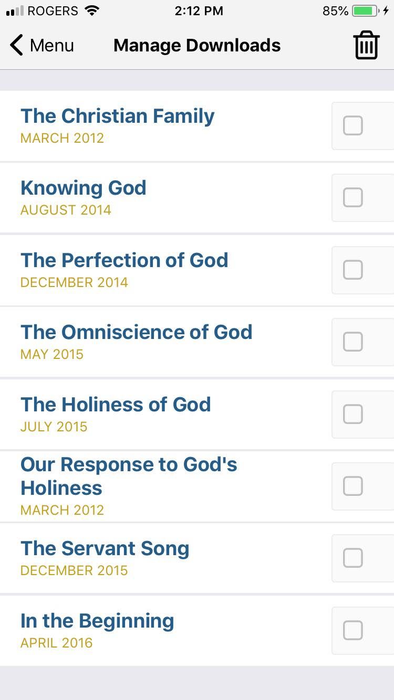
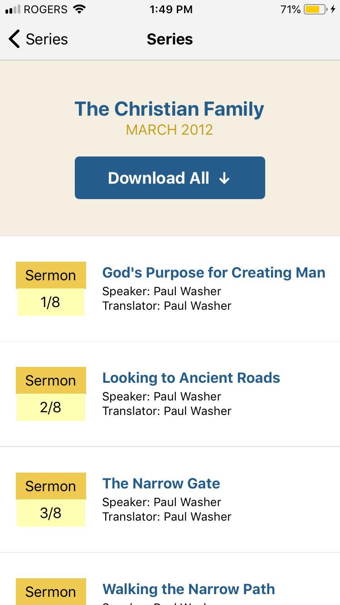

As per the requirements laid out by the Gospel China Bridge organization, the app was required to better serve their users (especially in China), to allow them to stream and watch Sunday sermons. In China, since websites with content related to Christianity are usually banned, the organization calls for a more reliable method of delivering the information. Thus, an app with a flexible back-end server setup was designed.

The main function of the app is to allow users, especially Chinese users, to stream, watch, or listen to Sunday sermons in audio and video format. It allows users to stream or download the content, as well as manage their downloads. The app also displays announcements, events, speakers, and general information about the Gospel China Bridge organization.

## Commands

### `yarn start`

Runs your app in development mode.

Open it in the [Expo app](https://expo.io) on your phone to view it. It will reload if you save edits to your files, and you will see build errors and logs in the terminal.

Sometimes you may need to reset or clear the React Native packager's cache. To do so, you can pass the `--reset-cache` flag to the start script:

```
yarn start --reset-cache
```

### `yarn run ios`

Like `yarn start`, but also attempts to open your app in the iOS Simulator if you're on a Mac and have it installed.

### `yarn run android`

Like `yarn start`, but also attempts to open your app on a connected Android device or emulator. Requires an installation of Android build tools (see [React Native docs](https://facebook.github.io/react-native/docs/getting-started.html) for detailed setup). We also recommend installing Genymotion as your Android emulator. Once you've finished setting up the native build environment, there are two options for making the right copy of `adb` available to Create React Native App:

#### Using Android Studio's `adb`

1. Make sure that you can run adb from your terminal.
2. Open Genymotion and navigate to `Settings -> ADB`. Select “Use custom Android SDK tools” and update with your [Android SDK directory](https://stackoverflow.com/questions/25176594/android-sdk-location).

#### Using Genymotion's `adb`

1. Find Genymotion’s copy of adb. On macOS for example, this is normally `/Applications/Genymotion.app/Contents/MacOS/tools/`.
2. Add the Genymotion tools directory to your path (instructions for [Mac](http://osxdaily.com/2014/08/14/add-new-path-to-path-command-line/), [Linux](http://www.computerhope.com/issues/ch001647.htm), and [Windows](https://www.howtogeek.com/118594/how-to-edit-your-system-path-for-easy-command-line-access/)).
3. Make sure that you can run adb from your terminal.

### De-duplicate package versions
We are using yarn-deduplicate to remove unnecessary versions of our packages. To
deduplicate, run `yarn-deduplicate yarn.lock`.


This project was bootstrapped with [Create React Native App](https://github.com/react-community/create-react-native-app).

Below you'll find information about performing common tasks. The most recent version of this guide is available [here](https://github.com/react-community/create-react-native-app/blob/master/react-native-scripts/template/README.md).

### `yarn test`

Runs the [jest](https://github.com/facebook/jest) test runner on your tests.

This project is set up to use [jest](https://facebook.github.io/jest/) for tests. You can configure whatever testing strategy you like, but jest works out of the box. Create test files in directories called `__tests__` or with the `.test` extension to have the files loaded by jest. See the [the template project](https://github.com/react-community/create-react-native-app/blob/master/react-native-scripts/template/App.test.js) for an example test. The [jest documentation](https://facebook.github.io/jest/docs/en/getting-started.html) is also a wonderful resource, as is the [React Native testing tutorial](https://facebook.github.io/jest/docs/en/tutorial-react-native.html).

## Customizing App Display Name and Icon

You can edit `app.json` to include [configuration keys](https://docs.expo.io/versions/latest/guides/configuration.html) under the `expo` key.

To change your app's display name, set the `expo.name` key in `app.json` to an appropriate string.

To set an app icon, set the `expo.icon` key in `app.json` to be either a local path or a URL. It's recommended that you use a 512x512 png file with transparency.

## Screenshots

#### Loading screen


#### Home


#### Menu


#### Menu (cont.)


#### Events


#### Downloads


#### Downloads (cont.)


#### Series view


#### Sermons view


#### Play sermon (in progress)


#### Speakers menu


#### Speaker page


#### Web view


#### About


#### Contact form


#### Settings

